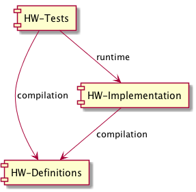

# HW-Implementation

This project is the starting point the practical HW in [Introduction to Formant Verification Methods class](https://www.cs.bgu.ac.il/~intvm171/). This document
explains how the homework system is built, how to submit your tasks and how they will be tested. So please read carefully.

## Design Overview
During the practical parts of the class, you will implement a transition system library using Java 8. Your implementation will be based on a provided interface, and
on other supporting classes. It will be tested using a set of unit tests.

In order to achieve good modularity, the system is composed of three different code bases:
* **[HW-Definitions](https://github.com/BGU-FVM/HW-Definitions)** - Code containing the definitions of the interfaces and classes. It also contains many utility classes
  that can be used to write transition systems. *Do not make any changes to this code.*
* **[HW-Implementation](https://github.com/BGU-FVM/HW-Implementation)** - This project. Write your code here. You can do whatever you like, as long as you:
    * Keep all the code and resources in package `il.ac.bgu.cs.fvm.impl`.
    * Keep the class `il.ac.bgu.cs.fvm.impl.FvmFacadeImpl`, and make sure it implements `FvmFacade`. For your convenience, the class' skeleton is provided. This class will be used as a starting point by the code at `HW-Definitions` for creating transition systems.
    * Don't create any dependencies in external resources or 3rd-party libraries (in particular, don't add any `.jar` files to your code). The automated test system will not be aware of them, and the compilation would fail.
* **[HW-Tests](https://github.com/BGU-FVM/HW-Tests)** - Where the tests live. The test suite in this project will be used to examine (and grade) your implementation. The source folder contains some [examples](https://github.com/BGU-FVM/HW-Tests/tree/master/src/il/ac/bgu/cs/fvm/examples)
    to help you understand how your implementation is used.

## Project Setup

1. `git clone` all the above projects. If you don't like Git, you can also download a zip file (look for the ["clone or download" button in the project's page](docs/dl-zip.png)).
2. Using your favorite IDE, setup each cloned repository as a project. Then, setup the projects dependencies like so:

   

    Note: The repos already contain [NetBeans](https://netbeans.org) projects. If you prefer [IntelliJ IDEA](https://www.jetbrains.com/idea/), you can easily setup the projects using `File Menu -> New -> Project from Existing Source...`. If you are using [Eclipse](https://eclipse.org), we've made a [guide](docs/eclipse-setup.md).
3. Write your code in `HW-Implementation`.
4. Test your code by running the unit tests of `HW-Tests`. You may add more tests if you want (we might add more tests too!).
5. Whatever you do, don't change `HW-Definitions`, or your code might not compile with our copy of it. This is a software *engineering* class, points will be deducted on being too smart for your own good (e.g. breaking the automated testing process due to compile errors).

## Submission Guidelines
1. Update file `students.txt` with your id number, email and name.
2. Zip the `HW-Implementation` project folder.
3. Submit the zip file through the usual system.

## FAQ
### Will you release a solution code?
No. You will be able to use the test results to fix your code, if we found any bugs.
### Why 3 separate projects?
Creating 2 projects - i.e. merging `HW-Test` and `HW-Definitions` - would create a circular dependency between the unified project and your implementation. We could overcome this using a 2-pass build process, but that would be error-prone (not to mention ugly). We could use a single project, but that would allow you to accidentally change our code and inadvertently create compile issues.
### Do I really have to use Git?
No, you can download the zip files and do everything manually. But note that:
* Using Git will make it easier for you to update your copies when we make changes to the central code.
* You'll have to start using a versioning system at some point, and if you haven't done so already, 4th year of software engineering degree is about time. Thank us later.

### Things don't work
Give it another go, ask other students, or try to identify the problem and search for a solution on-line.

### Things Still Don't Work
Please contact Michael, or come to his receptions hours. Or set up a meeting by email.
