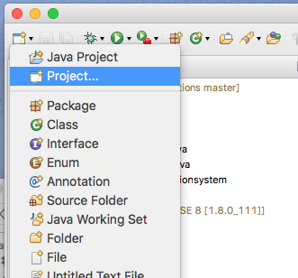
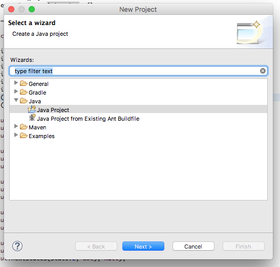
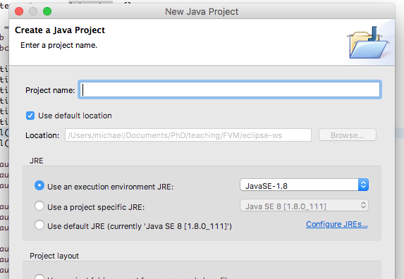
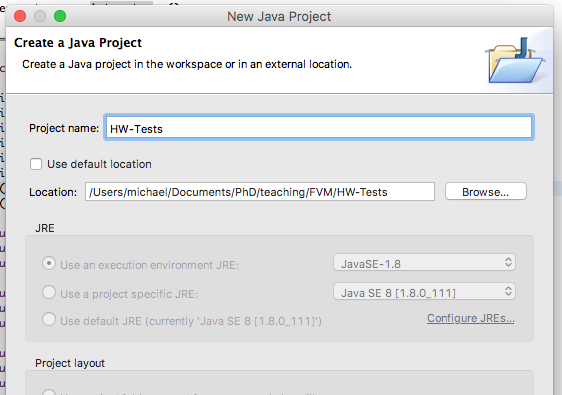
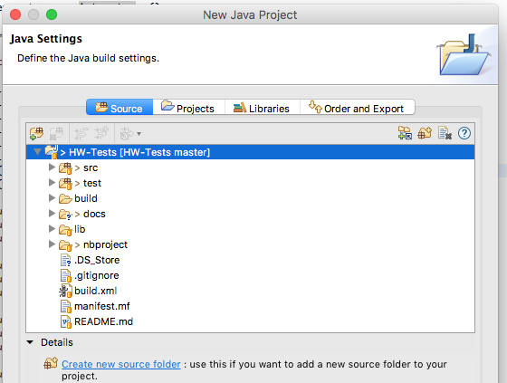
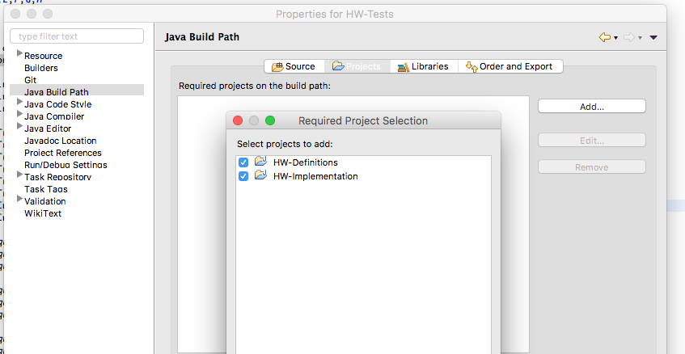

# Setting Up the HW Projects in Eclipse

For the purpose of this guide, we assume you've already cloned/downloaded the projects, as mentioned in [the main guide](../README.md). This guide was written using Eclipse Neon, the latest version at the time of writing.

1. From the `new` button/menu, choose `project...`

 

1. In the dialog that opens, select `Java->Java Project`

  

1. A "New Java Project" dialog opens. Uncheck the `Use default location` box so you can tell Eclipse where the code is.

  

  Once you've unchecked the box, locate the top-level folder of the project, by clicking the `browse` button and selecting the folder:

    

  click `Next`

1. Make sure that the `src` and `test` folders are identified as source folders. They should have that little package-inside-a-folder icon.

  

1. Congrats! You now have an Eclipse project. Repeat with the other two projects you're checked out.

1. Now add project inter-dependencies. Right-click the project, and select `Properties` from the contextual menu. Select `Java Build Path` on the side menu, and the `Projects` tab on the main pane. Click `Add...` and select the required projects.

  * *HW-Tests* requires both *HW-Implementation* and *HW-Definitions*
  * *HW-Implementation* requires *HW-Definitions* only  

  

1. Now test your implementation: Right-click `HW-Tests`'s `test` folder, and select `Run As -> JUnit Test` from the contextual menu. You should see a lot of failed tests in the JUnit report pane. That's cool - the provided implementation skeleton does not implement any of the tested functionality.

1. Implement the tested functionality. Test your code using the technique show in the previous step.
